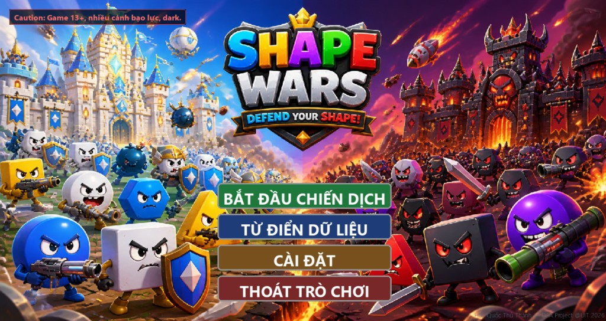
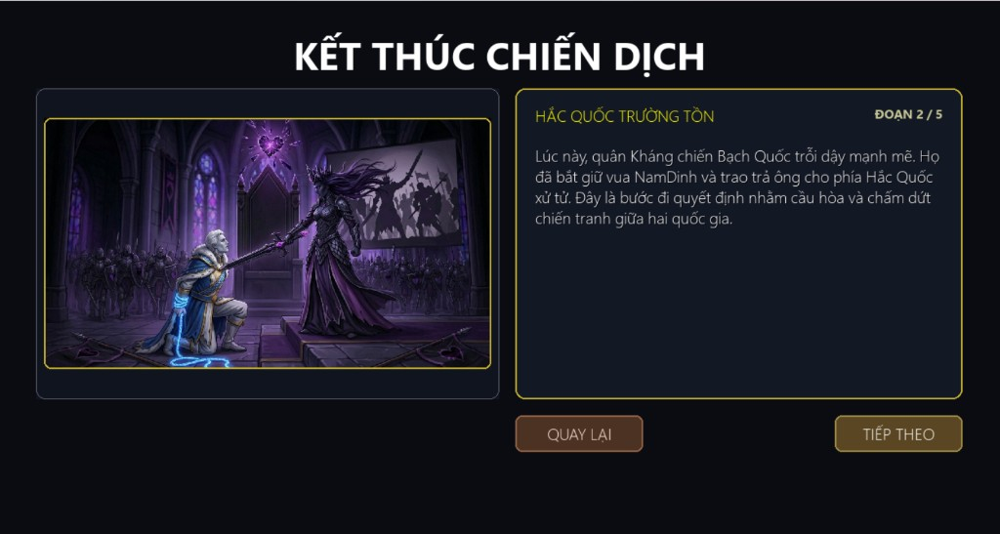
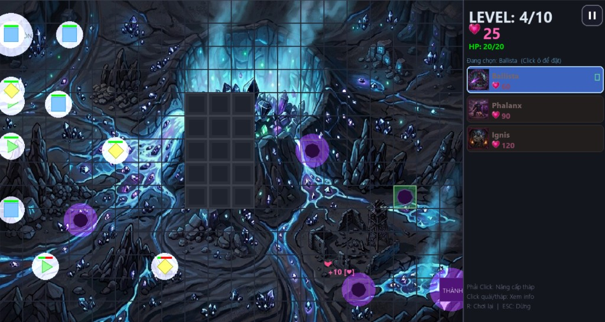
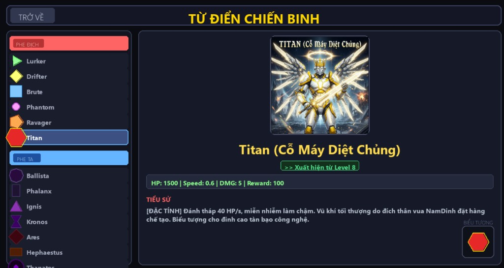
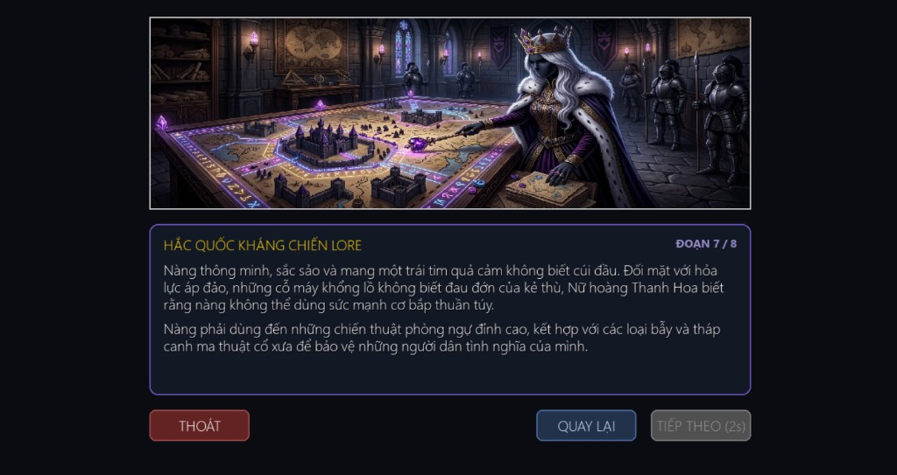
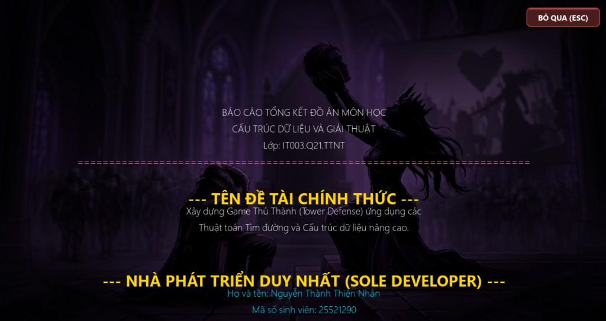

# Hắc Quốc Thủ Thành (Shapes Wars)

Một game Tower Defense đậm chất ?, được viết hoàn toàn bằng Python + Pygame.

---

## 🎮 Chơi ngay — Hướng dẫn nhanh

### Cách 1: Chạy file .exe (đơn giản nhất)

1. Vào trang [Releases](https://github.com/bersious/Shapes-Wars/releases) trên GitHub
2. Tải file `ShapesWar.exe` mới nhất về
3. Giải nén (nếu có) và chạy `ShapesWar.exe`
4. Xong! Không cần cài Python hay bất kỳ phần mềm nào khác

### Cách 2: Chạy từ source code (dành cho người có Python)

1. Clone repository:
   ```bash
   git clone https://github.com/bersious/Shapes-Wars.git
   ```
2. Mở terminal trong thư mục vừa tải, chạy:
   ```bash
   pip install pygame
   python main.py
   ```

> **Lưu ý:** Nếu muốn phát video intro/logo, cài thêm OpenCV:
> ```bash
> pip install opencv-python
> ```
> và đặt file `assets/video/logo.mp4` / `intro.mp4` vào thư mục `assets/video/`.

---

## 📸 Screenshots

| | |
|:--:|:--:|
|  |  |
| *Menu chính* | *Gameplay* |
|  |  |
| *Chiến đấu* | *Chọn tháp* |
|  |  |
| *Xem trước wave* | *Chiến thắng* |

---

## Giới thiệu

**Hắc Quốc Thủ Thành** là game Tower Defense lấy cảm hứng từ một câu chuyện khoa học viễn tưởng, nơi thế giới bị chia cắt mạnh mẽ bởi 2 chủng tộc và 2 thế giới đối lập nhau. Người chơi điều khiển Nữ hoàng Thanh Hoa của Hắc Quốc, xây dựng hệ thống tháp phòng thủ để chống lại đại quân Bạch Quốc xâm lược.

### Cốt truyện

Thế giới Hình Khối bị chia cắt thành hai cực đối lập: **Bạch Quốc** phương Bắc (khoa học, công nghệ) và **Hắc Quốc** phương Nam (tình nghĩa, đoàn kết). Khi vua NamDinh của Bạch Quốc phát động chiến tranh vì định kiến chủng tộc, Nữ hoàng Thanh Hoa phải dùng chiến thuật phòng thủ đỉnh cao để bảo vệ Hắc Quốc.

---

## Tính năng chính

- **8 level campaign** với cốt truyện riêng cho từng màn chơi
- **6 loại tháp phòng thủ** (Ballista, Phalanx, Ignis, Kronos, Ares, Hephaestus, Thanatos) với đặc điểm và chiến thuật riêng
- **6 loại quái vật** (Lurker, Drifter, Brute, Phantom, Ravager, Titan) với sức mạnh tăng dần
- **Hệ thống thùng tiến độ (LinkedList)** — thùng nâng cấp tháp, mở khóa khi chơi đủ số wave
- **Crossfade nhạc nền** — 2 track xen kẽ mượt mà trong gameplay
- **Crossfade đồ họa** giữa các màn chơi
- **Video intro/logo** (nếu có OpenCV)
- **Lưu tiến độ** tự động giữa các lần chơi
- **Tutorial level 0** hướng dẫn người chơi mới

---

## Cấu trúc dữ liệu & giải thuật

| File | Mô tả |
|------|-------|
| `main.py` | Game loop, đồ họa, UI, âm thanh, gameplay chính |
| `entities.py` | Tháp, quái, base, registry, cấu hình sóng |
| `algorithms.py` | BFS tìm đường, đệ quy tính lại đường khi grid thay đổi |
| `data_structures.py` | `LinkedList` (thùng tiến độ), `Queue` (hàng đợi sóng), `PriorityQueue` |

### Giải thuật nổi bật
- **BFS** cho pathfinding của quái vật
- **Recursion + memoization** tính lại tất cả đường khi grid thay đổi
- **Priority Queue** cho thuật toán Dijkstra (nếu dùng)

---

## Điều khiển

| Thao tác | Phím |
|----------|------|
| Di chuyển tháp trên grid | Chuột trái kéo thả |
| Chọn tháp để đặt | Click chuột trái vào tháp trong sidebar |
| Bán / Nâng cấp tháp | Click chuột phải vào tháp đã đặt |
| Xem thông tin tháp | Di chuột qua tháp |
| Bắt đầu wave | Nút **NEXT WAVE** |
| Tạm dừng | Phím **P** |
| Bật/tắt âm thanh | Phím **M** |
| Quay về Menu | Phím **ESC** |

---

## Xây dựng file .exe (tuỳ chọn)

```bash
pip install pyinstaller
pyinstaller main.spec
```

File thực thi sẽ nằm trong thư mục `dist/`.

---

## Credits

- **Người phát triển:** Bersious
- **Hoàn thành:** 18–21/05/2026
